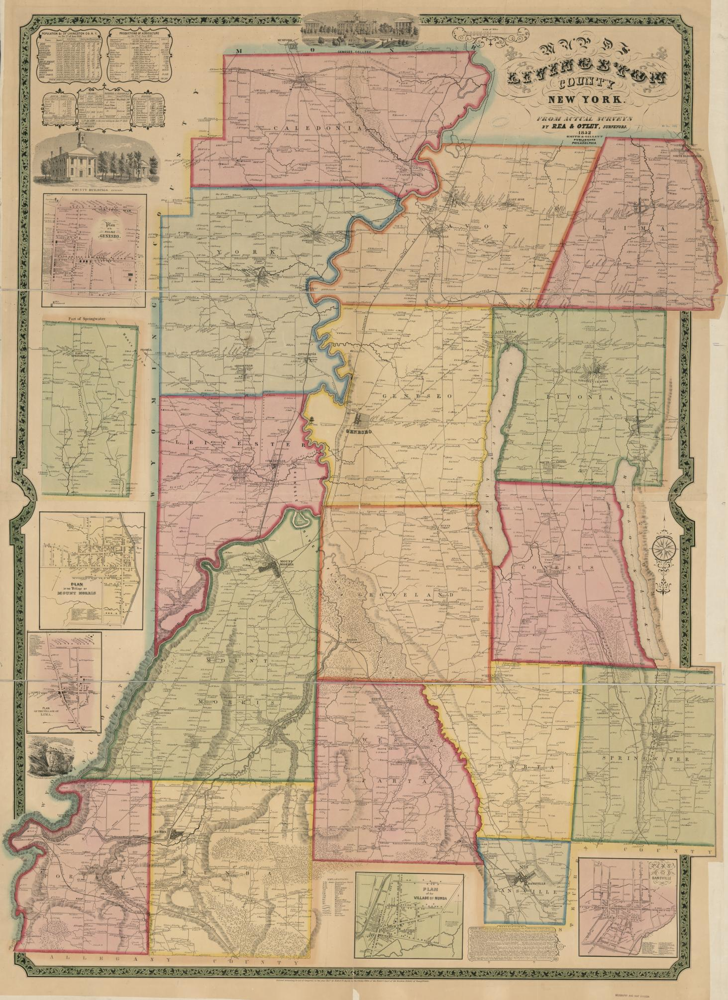
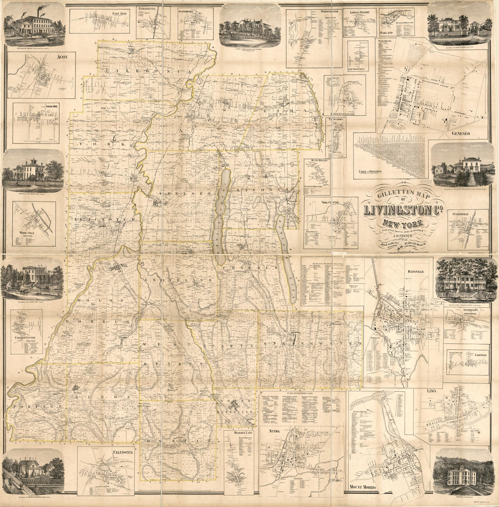

context on maps, why mapping, notes from genealogy article

[{fig-alt="Ninteenth century map from 1850 showing the different towns that make up Livingston County New York. Each town's boundaries are defined by different colors"}](https://lccn.loc.gov/2013593275)

[{fig-alt="Nineteenth Century map from an 1858 survey map showing the different towns in Livingston County, New York. The different dots on the map have different names of residents who lived in the county. There are also pop outs of detailed street maps of main cities in Livingston, County including Danville, Conesus Centre, and Hemlock Lake."}](https://lccn.loc.gov/2013593226)
